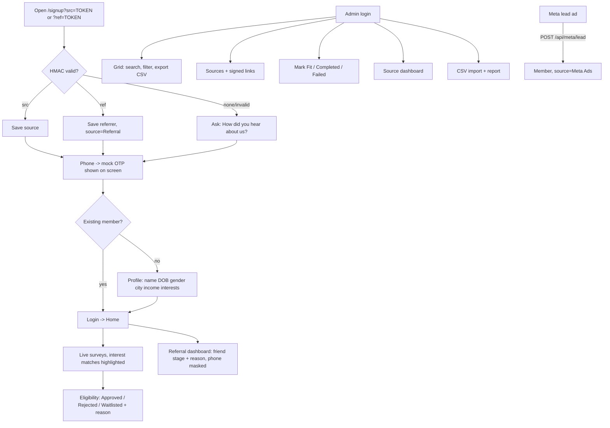

# User flow (frozen after Day 2 - later changes go in NEW files)

```mermaid
flowchart TD
  A[Open /signup?src=TOKEN or ?ref=TOKEN] --> B{HMAC valid?}
  B -- src --> C[Save source]
  B -- ref --> D[Save referrer, source=Referral]
  B -- none/invalid --> E[Ask: How did you hear about us?]
  C & D & E --> F[Phone -> mock OTP shown on screen]
  F --> G{Existing member?}
  G -- yes --> H[Login -> Home]
  G -- no --> I[Profile: name DOB gender city income interests] --> H
  H --> J[Live surveys, interest matches highlighted]
  J --> K[Eligibility: Approved / Rejected / Waitlisted + reason]
  H --> L[Referral dashboard: friend stage + reason, phone masked]
  M[Admin login] --> N[Grid: search, filter, export CSV]
  M --> O[Sources + signed links]
  M --> P[Mark Fit / Completed / Failed]
  M --> Q[Source dashboard]
  M --> R[CSV import + report]
  S[Meta lead ad] -->|POST /api/meta/lead| T[Member, source=Meta Ads]
```
